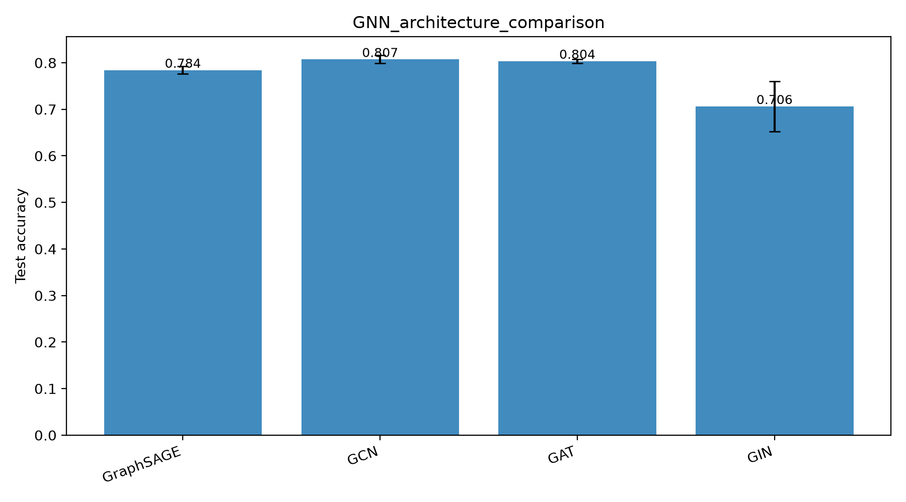
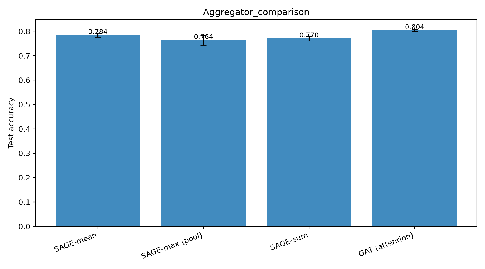
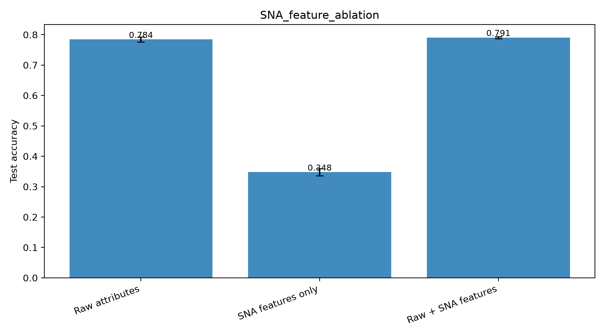
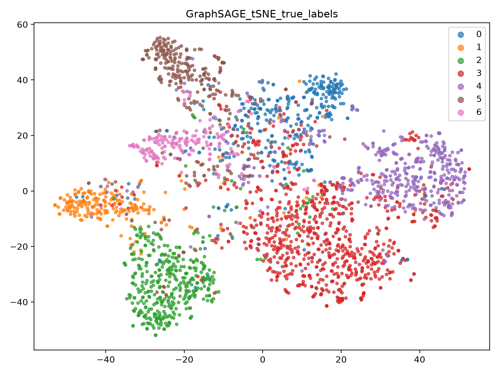
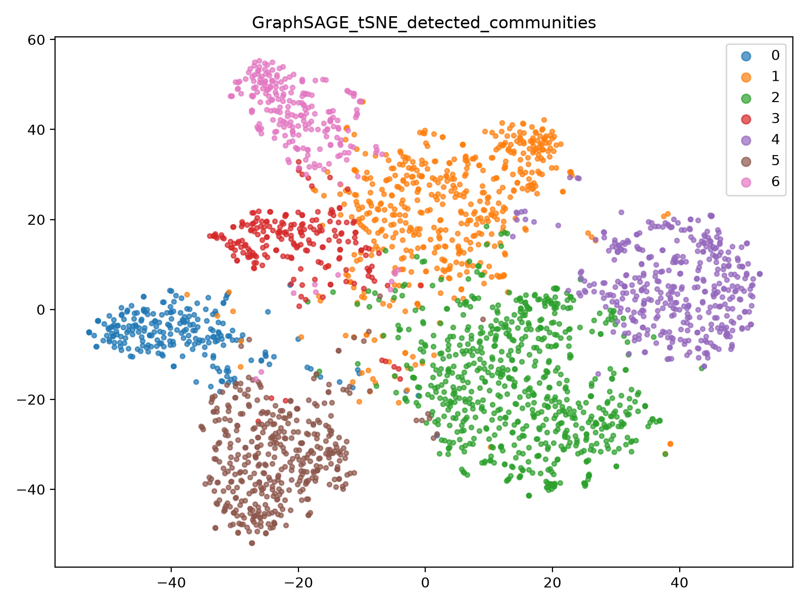
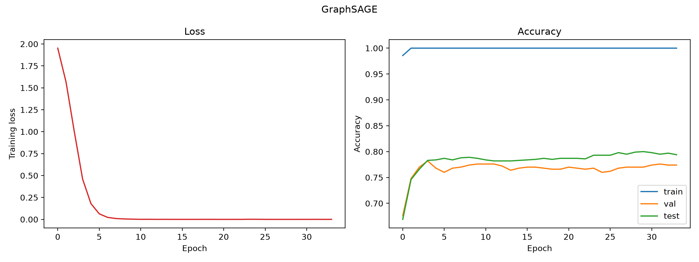

<div align="center">

# 🕸️ SNA-GraphSAGE

### Social Network Analysis with Graph Neural Networks

*A research framework built around **GraphSAGE** — extending "Social Network Analysis Based on GraphSAGE" (Xiao et al., ISCID 2019) with modern GNN architectures, classic SNA structural features, degree-adaptive neighbor sampling, and two extra graph tasks (link prediction & community detection). Every result is **mean ± std over 3 seeds**, with validation-based selection — no test-set peeking.*

<br/>

[](https://www.python.org/)
[](https://pytorch.org/)
[](https://pytorch-geometric.readthedocs.io/)
[](https://scikit-learn.org/)
[](https://networkx.org/)

[](LICENSE)


</div>

---

## 📖 Overview

**SNA-GraphSAGE** is a research framework for **Social Network Analysis (SNA) using
Graph Neural Networks**. It reproduces and extends the central claim of the
reference paper — that fusing *node attributes* with *graph structure* beats either
signal alone — and wraps it in a rigorous, reproducible experimental harness across
node classification, link prediction, and community detection.

It combines four GNN architectures under one class, injects eight classic centrality
features, implements the paper's degree-adaptive sampler, and benchmarks everything
against feature-only and structure-only baselines — all with validation-based model
selection, early stopping, and multi-seed variance reporting.

> **The one-liner:** a stage-based runner trains GraphSAGE / GCN / GAT / GIN on
> Planetoid graphs, ablates SNA structural features and network depth, compares fixed
> vs. degree-adaptive neighbor sampling, and evaluates link prediction (ROC-AUC/AP)
> and community detection (NMI/ARI) — reporting mean ± std over seeds {42, 43, 44}.

---

## ✨ What's Inside

| Component | Description |
|-----------|-------------|
| 🧠 **Architecture zoo** | GraphSAGE, GCN, GAT, GIN under one unified `GNN` class ([`models/gnn_zoo.py`](models/gnn_zoo.py)) |
| 🔀 **Aggregator study** | SAGE mean / max-pool / sum vs. GAT-style learned attention |
| 📐 **SNA structural features** | Degree, clustering, PageRank, approx. betweenness, eigenvector centrality, k-core, avg. neighbor degree — z-scored and injected, with a full ablation |
| 🎯 **Degree-adaptive sampling** | The paper's rule `Sᵢ = c + ⌈Nᵢ·w⌉` (capped), in a hand-rolled layered neighbor sampler |
| 🔗 **Link prediction** | GraphSAGE encoder + dot-product decoder, per-epoch negative resampling, ROC-AUC / AP |
| 👥 **Community detection** | Louvain vs. KMeans on raw features vs. KMeans on learned embeddings (NMI / ARI) |
| 📊 **Baselines** | Logistic Regression on raw features; DeepWalk (random walks + Word2Vec) + LR |
| 🔬 **Diagnostics** | Training curves, confusion matrices, PCA & t-SNE plots, depth (oversmoothing) & label-rate studies |

> 📐 Full method + how each stage connects lives in **[`docs/ARCHITECTURE.md`](docs/ARCHITECTURE.md)**.

---

## 📈 Results *(Cora, 3 seeds)*

### 1) Node classification — baselines vs. GNN architectures

| Model | Test accuracy | Macro-F1 |
|-------|:-------------:|:--------:|
| Logistic Regression (features only) | 0.576 | — |
| DeepWalk + LR (structure only) | 0.696 | — |
| GraphSAGE | 0.784 ± 0.008 | 0.777 ± 0.005 |
| GIN | 0.706 ± 0.054 | 0.682 ± 0.084 |
| GAT | 0.804 ± 0.004 | 0.798 ± 0.006 |
| **GCN** | **0.807 ± 0.008** | **0.800 ± 0.006** |

Models that combine attributes **and** structure beat both single-source baselines by 10–23 points — mirroring the paper's central claim.

<div align="center">
  
</div>

### 2) Aggregator comparison · 3) SNA feature ablation

<table>
  <tr>
    <td width="50%" align="center">
      <b>Learned attention &gt; fixed aggregators</b><br/>
      <sub>SAGE mean 0.784 · max 0.764 · sum 0.770 · <b>GAT attention 0.804</b></sub><br/><br/>
      
    </td>
    <td width="50%" align="center">
      <b>Structure carries signal attributes miss</b><br/>
      <sub>SNA-only 0.348 · raw 0.784 · <b>raw + SNA 0.791</b> (2.4× lower variance)</sub><br/><br/>
      
    </td>
  </tr>
</table>

### 4) Depth · 5) Label efficiency · 6) Neighbor sampling

| Layers | 1 | 2 | **3** | 4 |
|--------|:--:|:--:|:-----:|:--:|
| Test acc | 0.702 | 0.784 | **0.806** | 0.804 |

Accuracy saturates at **3 hops** (oversmoothing beyond) — distant users add little.

| Sampling | Fixed fan-out `[10,10]` | **Adaptive `Sᵢ=5+⌈0.5·deg(i)⌉`, cap 25** |
|----------|:-----------------------:|:-----------------------------------------:|
| Test acc | 0.799 | **0.819** |

The paper's degree-proportional rule gives a **+2 point** gain over fixed fan-out — a larger margin than the +0.26 reported on Weibo.

### 7) Link prediction · 8) Community detection

| Link prediction | Value | | Community method | NMI | ARI |
|-----------------|:-----:|---|------------------|:---:|:---:|
| Test ROC-AUC | 0.831 | | KMeans on raw features | 0.147 | 0.068 |
| Test Avg. Precision | 0.835 | | Louvain (structure only) | 0.448 | 0.262 |
| | | | **KMeans on GraphSAGE embeddings** | **0.574** | **0.559** |

The learned embeddings fuse content and structure and dominate both single-source methods.

<table>
  <tr>
    <td width="50%" align="center"><b>t-SNE — true classes</b><br/></td>
    <td width="50%" align="center"><b>t-SNE — detected communities</b><br/></td>
  </tr>
</table>

<div align="center">
  <b>GraphSAGE training curves</b> — early stopping on validation accuracy<br/><br/>
  
</div>

> 🖼️ The complete set of generated plots (confusion matrices, PCA/t-SNE, per-baseline embeddings) lives in [`figures/`](figures/).

---

## 🛠️ Tech Stack

| Layer | Technology |
|-------|-----------|
| **Language** | Python 3.9+ |
| **Deep learning** | PyTorch · PyTorch Geometric (GraphSAGE / GCN / GAT / GIN) |
| **Classic ML** | scikit-learn (LogReg, KMeans, metrics) |
| **Graph / SNA** | NetworkX (centralities, Louvain), Gensim (DeepWalk / Word2Vec) |
| **Data / viz** | NumPy · pandas · Matplotlib · tqdm |
| **Datasets** | Planetoid — Cora · CiteSeer · PubMed |

---

## 🚀 Installation

```bash
# 1. Clone the repository
git clone https://github.com/bhanu87777/SNA-GraphSAGE.git
cd SNA-GraphSAGE

# 2. Install dependencies
pip install -r requirements.txt
```

The Planetoid datasets (Cora / CiteSeer / PubMed) download automatically to `data/`
on first run — no manual setup required. Everything runs on CPU (~3–4 min for a full
Cora run); a CUDA GPU is used automatically when available.

---

## 📋 Usage

```bash
python main.py                          # all stages on Cora
python main.py --stages models,community
python main.py --dataset CiteSeer       # also: PubMed
python main.py --quick                  # single seed, fewer epochs
```

**Stages:** `baselines`, `models`, `aggregators`, `features`, `depth`, `labelrate`, `sampling`, `linkpred`, `community`.

Numeric results are written to `results/results_<dataset>.json`; plots to `figures/`.

---

## 📁 Project Structure

```
SNA-GraphSAGE/
├── config.py                     # all hyperparameters + seeds
├── main.py                       # stage-based experiment runner (argparse)
├── requirements.txt
├── models/
│   ├── gnn_zoo.py                # unified GraphSAGE / GCN / GAT / GIN
│   ├── link_predictor.py         # encoder-decoder link prediction
│   ├── deepwalk_model.py         # random walks + Word2Vec baseline
│   └── logistic_regression.py    # feature-only baseline
├── experiments/
│   ├── model_comparison.py       # architecture + aggregator studies
│   ├── feature_ablation.py       # raw vs SNA vs raw+SNA
│   ├── layer_experiments.py      # depth / oversmoothing
│   ├── sampling_experiments.py   # fixed vs degree-adaptive sampling
│   └── community_detection.py    # Louvain vs KMeans variants (NMI/ARI)
├── utils/
│   ├── data_loader.py            # Planetoid datasets + feature augmentation
│   ├── structural_features.py    # SNA centralities (cached)
│   ├── train_utils.py            # early stopping, val selection, multi-seed
│   ├── metrics.py                # accuracy, F1, confusion matrix
│   └── visualization.py          # PCA/t-SNE, curves, confusion, bar charts
├── figures/                      # generated plots (committed)
├── results/                      # generated JSON metrics (committed)
├── assets/screenshots/           # curated README gallery
└── docs/
    ├── ARCHITECTURE.md
    ├── Enhanced_SNA_GNN_Paper.pdf        # this project's extended write-up
    ├── MPResearch.pdf                    # reference: Xiao et al., ISCID 2019
    ├── SNA_GraphSAGE_1_Results_Walkthrough.pdf
    └── SNA_GraphSAGE_2_Codebase_Guide.pdf
```

---

## 🔭 Future Improvements

- [ ] **More datasets** — OGB (ogbn-arxiv), Reddit, and a real social graph (Weibo-style)
- [ ] **Inductive split** — evaluate GraphSAGE's inductive generalization on unseen nodes
- [ ] **Scalability** — mini-batch neighbor loaders for graphs that don't fit in memory
- [ ] **More tasks** — influence maximization, anomaly / bot detection
- [ ] **Hyperparameter sweeps** — Optuna over hidden dim, depth, sampling caps
- [ ] **Explainability** — GNNExplainer / attention visualization on predictions
- [ ] **Config/CLI unification** — YAML experiment configs + logged run manifests

---

## 🤝 Contributing

Contributions, issues, and feature requests are welcome!

1. Fork the project
2. Create your feature branch (`git checkout -b feature/amazing-feature`)
3. Commit your changes (`git commit -m 'Add amazing feature'`)
4. Push to the branch (`git push origin feature/amazing-feature`)
5. Open a Pull Request

---

## 📚 References

- Xiao, Wu, Wang. *Social Network Analysis Based on GraphSAGE.* ISCID 2019 — [`docs/MPResearch.pdf`](docs/MPResearch.pdf)
- Hamilton, Ying, Leskovec. *Inductive Representation Learning on Large Graphs.* NeurIPS 2017
- This project's extended write-up: [`docs/Enhanced_SNA_GNN_Paper.pdf`](docs/Enhanced_SNA_GNN_Paper.pdf)

---

## 📄 License

Distributed under the **MIT License**. See [`LICENSE`](LICENSE) for details.

---

## 👤 Author

**Bhanu Prakash M**

[](https://github.com/bhanu87777)

> 💡 If SNA-GraphSAGE helped or impressed you, consider giving the repo a ⭐ — it genuinely helps!

<div align="center">
<sub>Built with PyTorch Geometric, scikit-learn, and NetworkX — reproducible graph learning, 3 seeds at a time.</sub>
</div>
