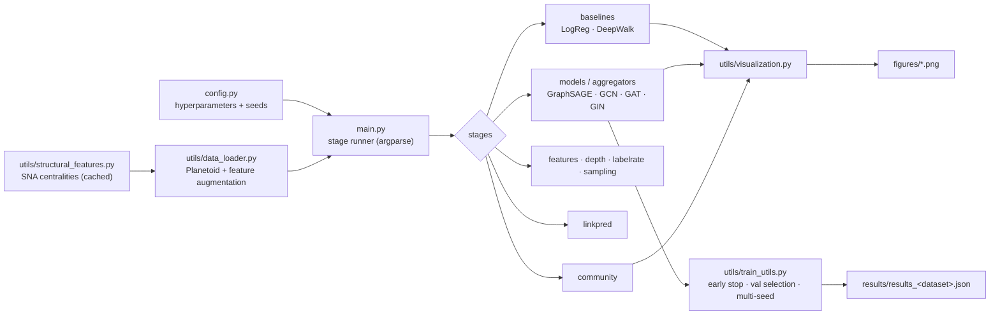

# 🏗️ SNA-GraphSAGE — Architecture

A stage-based experiment runner (`main.py`) driving a small library of GNN models,
experiments, and utilities for **Social Network Analysis with Graph Neural
Networks**. Every headline number is a **mean ± std over 3 seeds** with
validation-based model selection — no test-set peeking.

---

## 1. How a run flows



Run the whole thing or any subset:

```bash
python main.py                              # all stages on Cora
python main.py --stages models,community    # a subset
python main.py --dataset CiteSeer           # Cora | CiteSeer | PubMed
python main.py --quick                      # single seed, fewer epochs
```

Stages: `baselines`, `models`, `aggregators`, `features`, `depth`, `labelrate`,
`sampling`, `linkpred`, `community`.

---

## 2. The model zoo (`models/gnn_zoo.py`)

GraphSAGE, GCN, GAT, and GIN live under **one unified `GNN` class**, so the
architecture study is a single fair comparison — same training loop, same
selection protocol, same seeds — differing only in the convolution operator and
aggregator.

| Model | Aggregation |
|-------|-------------|
| **GraphSAGE** | mean / max-pool / sum over sampled neighbors |
| **GAT** | learned multi-head attention over neighbors |
| **GCN** | symmetric-normalized mean |
| **GIN** | sum + MLP (injective) |

Other models: `link_predictor.py` (encoder + dot-product decoder),
`deepwalk_model.py` (random walks + Word2Vec baseline),
`logistic_regression.py` (feature-only baseline), and a legacy standalone
`graphsage_model.py` (superseded by the zoo).

---

## 3. What extends the reference paper

The base work is *"Social Network Analysis Based on GraphSAGE"* (Xiao et al.,
ISCID 2019). This framework adds:

1. **Modern architectures** — GCN / GAT / GIN alongside GraphSAGE under one class.
2. **Classic SNA structural features** — degree, clustering coefficient, PageRank,
   approximate betweenness (128-pivot), eigenvector centrality, k-core, average
   neighbor degree — z-scored and injected as node features, with a full ablation
   (`utils/structural_features.py`, cached to `data/structural_<dataset>.npy`).
3. **Degree-adaptive neighbor sampling** — the paper's rule
   `Sᵢ = clip(c + ⌈w·deg(i)⌉, 1, cap)` in a hand-rolled layered sampler
   (`ADAPTIVE_C=5`, `ADAPTIVE_W=0.5`, `ADAPTIVE_CAP=25`).
4. **Two extra graph tasks** — link prediction (ROC-AUC / AP) and community
   detection (NMI / ARI).
5. **A rigorous protocol** — validation-based selection, early stopping (patience
   30), and mean ± std over seeds {42, 43, 44}.

---

## 4. Experiments (`experiments/`)

| File | Study |
|------|-------|
| `model_comparison.py` | Architecture (SAGE/GCN/GAT/GIN) + aggregator (mean/max/sum/attention) |
| `feature_ablation.py` | Raw attributes vs. SNA structural features vs. both |
| `layer_experiments.py` | Depth 1–4 (oversmoothing) |
| `sampling_experiments.py` | Fixed fan-out vs. degree-adaptive sampling |
| `community_detection.py` | Louvain vs. KMeans-on-raw vs. KMeans-on-embeddings (NMI/ARI) |

---

## 5. Methodology guarantees

- **Model selection** — the checkpoint with the best *validation* accuracy is
  restored, and test metrics are computed once, at that point.
- **Variance** — every headline number is averaged over 3 seeds and reported as
  mean ± std.
- **Structural features** — z-scored and cached to disk; betweenness uses a
  128-pivot approximation for tractability.
- **Link prediction** — edges split 85/5/10 with `RandomLinkSplit`; the encoder
  only ever sees training edges as message-passing structure, and negatives are
  **resampled every epoch** (fixing them overfits — AUC drops from 0.83 to 0.73).

---

## 6. Project layout

```
config.py                     all hyperparameters + seeds
main.py                       stage-based experiment runner (argparse)
models/
  gnn_zoo.py                  unified GraphSAGE / GCN / GAT / GIN
  link_predictor.py           encoder-decoder link prediction
  deepwalk_model.py           random walks + Word2Vec baseline
  logistic_regression.py      feature-only baseline
experiments/                  one file per study (see table above)
utils/
  data_loader.py              Planetoid datasets + feature augmentation
  structural_features.py      SNA centralities (cached)
  train_utils.py              early stopping, val selection, multi-seed
  metrics.py                  accuracy, F1, confusion matrix
  visualization.py            PCA/t-SNE, curves, confusion, bar charts
figures/                      generated plots (committed)
results/                      generated JSON metrics (committed)
docs/                         papers + walkthrough PDFs
```
